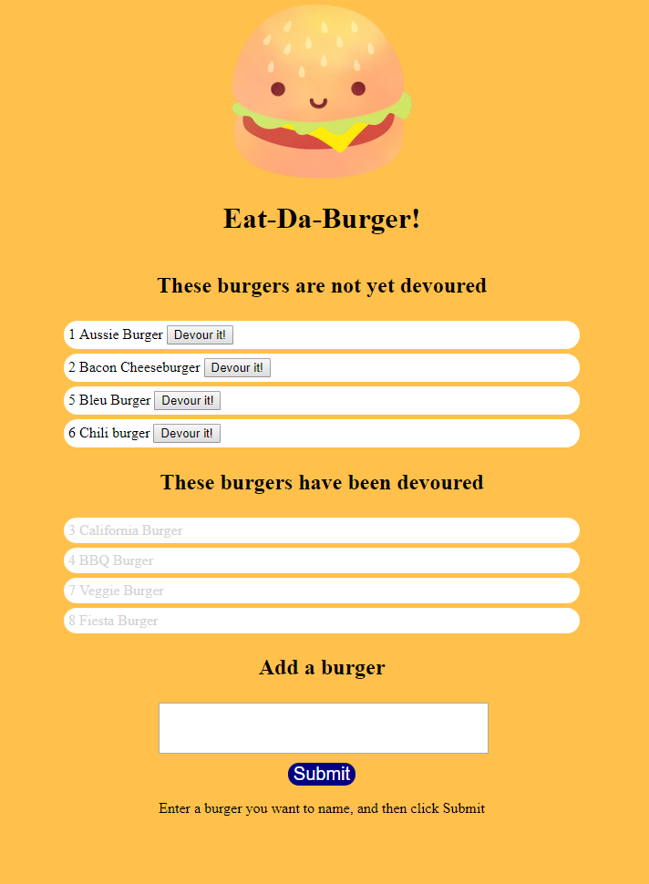

# Eat-Da-Burger-Sequelize

Eat-Da-Burger! is a restaurant app that lets users input the names of burgers they'd like to eat.

To use the app, type the name of the burger you want to eat into the field and press "Submit"
Click the Devour button next to the burger to eat it.
Burgers that are eaten and removed from the available burgers list and are grayed out.

